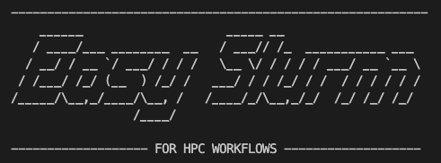
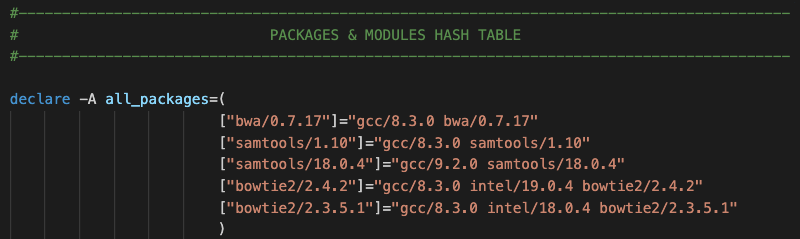
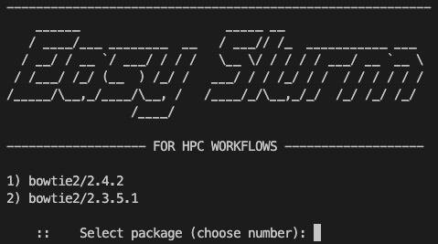

<div id="top"></div>

<!-- PROJECT SHIELDS -->
[![Contributors][contributors-shield]][contributors-url]
[![Forks][forks-shield]][forks-url]
[![Stargazers][stars-shield]][stars-url]
[![Issues][issues-shield]][issues-url]
<!-- [![License][license-shield]][license-url] -->


<!-- PROJECT TITLE -->
<br />
<div align="center">
  <a href="https://github.com/leebardon/easy_slurm">
  
  </a>

<h2 align="center">Easy Slurm</h2>

  <p align="center">
    
    Instantly generate Slurm scripts with the correct module and package dependancies.
    
  </p>
</div>


<!-- TABLE OF CONTENTS -->
<details>
  <summary>Table of Contents</summary>
  <ol>
    <li>
      <a href="#about-the-project">About Easy Slurm</a>
    </li>
    <li>
      <a href="#getting-started">Getting Started</a>
      <ul>
        <li><a href="#prerequisites">Prerequisites</a></li>
        <li><a href="#installation">Installation</a></li>
      </ul>
    </li>
    <li><a href="#usage">Usage</a></li>
    <li><a href="#contributing">Contributing</a></li>
    <li><a href="#license">License</a></li>
    <li><a href="#contact">Contact</a></li>
  </ol>
</details>


<!-- ABOUT THE PROJECT -->
## Easy Slurm

>                    !==   Avoid the endless chore of module spider-ing and copy-pasta-ing  ==!
>    
>       !==   Fahgeddabout 'finding that other script with the Launcher commands in and copy-pasta-ing'   ==!


Easy Slurm is a HPC shell utility for quickly generating a 'skeleton' Slurm scripts. It allows the user to select the software they would like to load for their batch submission, and automatically appends the correct package dependancies to the script. The user may also choose to append a 'skeleton' sequence of Launcher lines for high throughput computing workflows.

Easy Slurm was created to avoid the hassle of manually copying and pasting 'boilerplate' code from other Slurm scripts, and of manually searching for the correct package versions that the software packages in your pipeline depend on. 

<p align="right">(<a href="#top">back to top</a>)</p>


<!-- GETTING STARTED -->
## Getting Started
### Prerequisites

The project was written for bash 4, and has not yet been tested on other shells (e.g. earlier bash versions, zsh, etc). 

### Adding Modules

Easy Slurm is currently intended to be customised by the user. That is, you must first manually add the software packages you use as part of your workflow, and the modules they depend on. You can add multiple versions of the same software. The good news is, you only need to do this once.

Open easy_slurm.sh in your preferred text editor. At the top, there is a section called "Packages & Modules Hash Table". Simply add your modules and dependancies such that the module name is the key, and the depandencies are in space-delimited string format, as follows: 

>     ["module_version"]="dependancy1 depandancy2 depandancyN module_version"


<div align="center">
  
</div>

### Installation

1. Clone the repo (preferably into a project utilities folder)
   ```sh
   git clone https://github.com/leebardon/easy_slurm.git
   ```

<p align="right">(<a href="#top">back to top</a>)</p>


<!-- USAGE EXAMPLES -->
## Usage

First, make the script executable:

```
$ chmod +x easy_slurm.sh
```

To see all modules currently stored in your Easy Slurm list, run the script with no arguments:

```
$ ./easy_slurm.sh
```

If your workflow involves a large number of software packages, or different versions of the same software, you can filter to see all stored versions that match a given pattern. For example:

```
$ ./easy_slurm.sh bow
```

will return all stored packages with the consecutive string pattern "bow" in the name:

<div align="center">
  
</div>


<p align="right">(<a href="#top">back to top</a>)</p>


<!-- CONTRIBUTING -->
## Contributing

Contributions are what make the open source community such an amazing place to learn, inspire, and create. Any contributions you make are **greatly appreciated**.

If you have a suggestion that would make this better, please fork the repo and create a pull request. You can also simply open an issue with the tag "enhancement".

1. Fork the Project
2. Create your Feature Branch (`git checkout -b feature/AmazingFeature`)
3. Commit your Changes (`git commit -m 'Added amazing feature!'`)
4. Push to the Branch (`git push origin feature/AmazingFeature`)
5. Open a Pull Request

<p align="right">(<a href="#top">back to top</a>)</p>


<!-- LICENSE -->
## License

Distributed under the MIT License. See `License.txt` for more information.

<p align="right">(<a href="#top">back to top</a>)</p>


<!-- CONTACT -->
## Contact

Lee Bardon - [@teatauri](https://twitter.com/teatauri) - leerbardon@gmail.com

Project Link: [https://github.com/leebardon/easy_slurm](https://github.com/leebardon/easy_slurm)

<p align="right">(<a href="#top">back to top</a>)</p>


<!-- MARKDOWN LINKS & IMAGES -->
<!-- https://www.markdownguide.org/basic-syntax/#reference-style-links -->
[contributors-shield]: https://img.shields.io/github/contributors/leebardon/easy_slurm.svg?style=for-the-badge
[contributors-url]: https://github.com/leebardon/easy_slurm/graphs/contributors
[forks-shield]: https://img.shields.io/github/forks/leebardon/easy_slurm.svg?style=for-the-badge
[forks-url]: https://github.com/leebardon/easy_slurm/network/members
[stars-shield]: https://img.shields.io/github/stars/leebardon/easy_slurm.svg?style=for-the-badge
[stars-url]: https://github.com/leebardon/easy_slurm/stargazers
[issues-shield]: https://img.shields.io/github/issues/leebardon/easy_slurm.svg?style=for-the-badge
[issues-url]: https://github.com/leebardon/easy_slurm/issues
[license-shield]: https://img.shields.io/github/license/leebardon/easy_slurm.svg?style=for-the-badge
[license-url]: https://github.com/leebardon/easy_slurm/blob/master/LICENSE.txt
<!-- [product-screenshot]: images/screenshot.png -->
